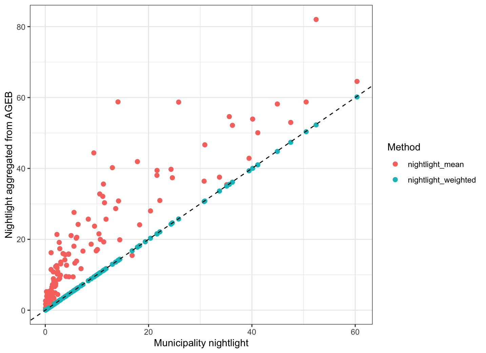

# Nightlight Data 
## Background
Nightlight data (or nighttime satellite imagery data) is widely used as an alternative dataset to approximate economics activity of regions because the data is available over time and for almost all the inhabited surface of the earth. For example, [Henderson et al. (2012)](https://edisciplinas.usp.br/pluginfile.php/4253686/mod_resource/content/1/Henderson%20et%20al%20-%20Measuring%20Economic%20Growth%20from%20Outer%20Space%20-%20AER%202012.pdf) develops a statistical framework to use satellite data on nightlights to augment official income growth measures. [Martínez (2022)](https://www.journals.uchicago.edu/doi/full/10.1086/720458#:~:text=This%20autocracy%20gradient%20in%20the,GDP%20growth%20by%20approximately%2035%25.) studies the overstatement of economic growth in autocracies by comparing self-reported GDP figures to night-time light recorded by satellites from outer space. [Vogel et al. (2024)](https://papers.ssrn.com/sol3/papers.cfm?abstract_id=4707908) integrates daytime and nighttime satellite imagery into a spatial general-equilibrium model to evaluate the returns to investments in new motorways in India.

In this project, I provided an overview of nightlight data source and processed the nightlight data in Mexico. In addition, I also collected Mexico census data to explore their correlation with nightlight intensity.

## Introduction on Major Data Sources
The main data sources that most nightlight-related literature depends on is DMSP-OLS (1992 - 2013) + VIIRS-DNB (2012 - Present). The following table  is a comparison between the two data sources. The two data sources can provide global daytime and nighttime light data of the Earth every 24 hours, but only a portion of them is of high quality.  

    
|  | DMSP-OLS | VIIRS-DNB |
| --- | --- | --- |
| Time Range | 1992-01-01 - 2014-01-01 | 2012-02-07 - Present |
| Temporal Resolution | Daily | Daily |
| Spatial Coverage | Global | Global |
| Spatial Resolution | 5km x 5km | 742m x 742m |
| Spectral Resolution | Single panchromatic channels covering the wavelengths ranging from 500 to 900 nanometers. | Single panchromatic channels covering the wavelengths ranging from 500 to 900 nanometers. |
| Quantization (Largest light intensity) | 6 bit | 14 bit |
| Raw Data Availability | Yes. One requires a fee ([NOAA](https://ngdc.noaa.gov/eog/availability.html)) and one is free ([Open Nighttime Lights](https://worldbank.github.io/OpenNightLights/wb-light-every-night-readme.html#viirs-dnb)). | Yes and open-source. There are two sources: [NASA](https://ladsweb.modaps.eosdis.nasa.gov/search/order/1/VNP46A1--5000,VNP46A2--5000,VNP46A4--5000,VNP46A3--5000/2024-02-07..2024-02-08/NB/Country:USA,MEX) and [NOAA](https://ncc.nesdis.noaa.gov/VIIRS/).  |

There are also some preprocessed composite products with lower temporal resolution but easier to use.

| Product | Base Data | Temporal Resolution | Spatial Resolution | Spatial Coverage |
| --- | --- | --- | --- | --- |
| [DMSP OLS: Nighttime Lights Time Series Version 4](https://developers.google.com/earth-engine/datasets/catalog/NOAA_DMSP-OLS_NIGHTTIME_LIGHTS) | DMSP-OLS | Annual (1992 - 2013) | 30 arc second (~1km at the Equator) | 180W, 75N, 65S, 180E (Thus the US, Mexico and Costa Rico should be recorded.) |
| [Annual VNL V2](https://eogdata.mines.edu/products/vnl/#monthly) | VIIRS-DNB | Annual (2012 - 2022) | 15 arc second (~500m at the Equator) | 180W, 75N, 65S, 180E (Thus the US, Mexico and Costa Rico should be recorded.) |
| [Light Every Night](https://worldbank.github.io/OpenNightLights/wb-light-every-night-readme.html) | DMSP-OLS + VIIRS-DNB | DMSP-OLS: Daily (1992-2017); IRS-DNB: Daily (~6 minute orbital segments from 2012 - 2020) | Same as the raw data. | Global |

Here are some wonderful nighttime light interactive maps.

1.  [https://eogdata.mines.edu/products/trip_the_light/](https://eogdata.mines.edu/products/trip_the_light/) This one has good resolution but it does not provide option to change the date.
2. [https://ladsweb.modaps.eosdis.nasa.gov/view-data/#l:VIIRS_SNPP_DayNightBand_At_Sensor_Radiance;@94.5,7.9,2.6z](https://ladsweb.modaps.eosdis.nasa.gov/view-data/#l:VIIRS_SNPP_DayNightBand_At_Sensor_Radiance;@94.5,7.9,2.6z)

## Extract Nightlight Data

### Procedure
The current data construction only complete the 2012 to 2023 part. The part before 2012 can be constructed with the same method described below.

**Data attributes Explanation (**[Google Earth Engine](https://developers.google.com/earth-engine/datasets/catalog/NOAA_VIIRS_DNB_ANNUAL_V22)**)**

| Name | Description | Remark |
| --- | --- | --- |
| average | Average DNB radiance values | VIIRS-DNB (V2) annual average are made on monthly increments. |
| average_masked | Average Masked DNB radiance values | with background, biomass burning, and aurora zeroed out |
| cf_cvg | Cloud-free coverages |  |
| cvg | Total number of observations free of sunlight and moonlight. |  |
| maximum | Maximum DNB radiance values. |  |
| median | Median DNB radiance values. |  |
| median_masked | Median Masked DNB radiance values. |  |
| minimum | Minimum DNB radiance values. |  |
- The GEE has some download/upload limit and thus it may raise some error if we want to use a higher resolution boundary.
- The method of extracting different region from VIIRS (or DMSP) data
    - The nightlight data are stored in raster data format, which is a matrix of nightlight intensity value
    - The boundary data are mainly stored in polygon (or vector) data format
    1. First, we can transform the two data into the same coordinate reference system, which can be automatically done in R or Python.
    2. Then we use the boundary data to crop the nightlight data i.e. using lat_max, lat_min, lon_max and lon_min to crop the nightlight data into a smaller rectangular region.
    3. Next, we mask those region that is not in the interior of the boundary.
        - The masking process may bring some errors - all cells that are not fully covered by the boundary are set to NA.

### Data Downloading

The nighttime light data from 2012 can be downloaded in <https://eogdata.mines.edu/products/vnl/>. You can either manually download them or run.
```{bash}
sh ./get_data.sh
```
The data are `VNL_npp_2023_global_vcmslcfg_v2_c202402081600.average_masked.dat.tif` etc.

The boundary data of Mexico is from <https://www.inegi.org.mx/app/biblioteca/ficha.html?upc=889463807469>. We mainly use the `.shp` file. Once downloaded, the data are in `./889463807469_s` folder.

The boundary data of Costa Rica can be found at https://drive.google.com/drive/folders/1u1OBbVwZ8BUfDWqugPDemnQZ1YSSEJ1x?usp=sharing.

### Nighttime Light Data for Mexico

The nighttime light data are generated for municipality, locality, AGEB and manzana level region in Mexico. To generate these data, we follow the algorithm below.

1.  Get the polygons for each considered region.
2.  Calculate the average nighttime light intensity of that region using nighttime light data map.

In addition, we provide a calibration process using different level nighttime light data. By the definition of our aggregation method, if one region (e.g. municipales) can be decomposed into multiple regions (e.g. básicas rurales and básicas urbana),

$$
A = \sum_{i=1}^N A_i
$$

the intensity of the region should be equal to

$$
\text{Intensity of }A = \sum_{i = 1}^N \frac{\text{Area}(A_i)}{\text{Area}(A)} \text{Intensity of }A_i
$$ 

For example, for each AGEB level data, we calculate the weighted average nighttime light intensity of all manzana level data within it and check whether it is close to the AGEB level nighttime light intensity. 

To get the result, one can run the following code. It may take quite a long time to get all the results.

``` bash
Rscript ExtractAGEB_Mexico.R
Rscript ExtractLOC_Mexico.R
Rscript ExtractManzana_Mexico.R

Rscript CheckAccuracy_Mexico.R
```

The generate outputs are in `outputs/` folder and are split for each state. Within each subfolder, we have data file `mun_level_nightlight.csv`, `loc_level_nightlight.csv`, `AGEB_level_nightlight.csv`, `Manzana_level_nightlight.csv`. It also includes some visualization of map and calibration results. We only did calibration on AGEB and manzana level data.

### Visualizations

Here I provide some visualizations of the extracted nighttime light data in Mexico.

<figure>
  
  <figcaption>Figure 1: Extracted Nightlight Data for Mexico from 201204 to 201303 (VIIRSV2.1). The value is the `average_masked` column of the dataset. The value is clipped by its 99.9% quantile to exclude outliers for better visualisation.</figcaption>
</figure>

<figure>
  
  <figcaption>Figure 2: Extracted Nightlight Data for México (state) from 2013 to 2022. The value is the `average_masked` column of the dataset. The value is clipped by its 99.9% quantile to exclude outliers for better visualisation.</figcaption>
</figure>

<figure>
  
  <figcaption>Figure 3: The intersection of 2012 VIIRS data and Áreas geoestadísticas básicas urbanas and Áreas geoestadísticas básicas rurales in México. The value for each region is calculated by area-weighed mean of nightlight raster data i.e.  the sum of nightlight value of cell i x (the area of the intersection between cell i and the AGEB region / the area of the AGEB region).</figcaption>
</figure>

<figure>
  
  <figcaption>Figure 4: Correctness check on the nightlight intensity calculated using the above method (`nightlight_weighted`). `nightlight_mean` is non-weighted average for comparison. </figcaption>
</figure>

### Nighttime Light Data for Costa Rica

The procedure are the same as Mexico part except that the state level data is aggregated using block level data. There is also a `ExtractBlock_Costa_Rica.R` file which is based on other shape file source (less than 492 district). To get the results, one can run

``` bash
Rscript ExtractBlock_Costa_Rica.R
Rscript ConstructState_Costa_Rica.R
```

There is no calibration for this since the data is aggregated to state level and thus state level data perfectly match block level. The results are in `costa_rica_outputs/` and not like Mexico part, all data are stored in `block_level_nightlight.csv` and `state_level_nightlight.csv` files.


